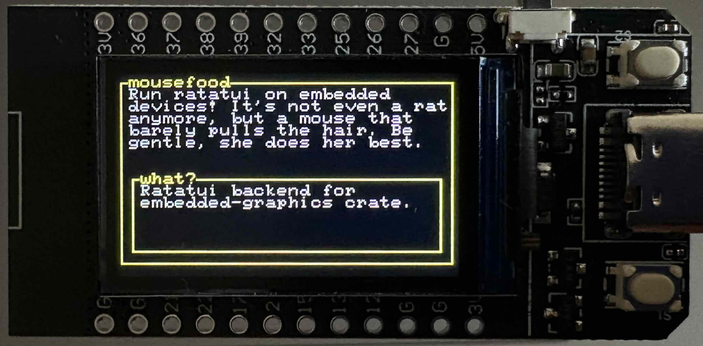

# Mousefood

[embedded-graphics](https://crates.io/crates/embedded-graphics) backend for [Ratatui](https://crates.io/crates/ratatui)!

🚧 **Under construction** 🏗️

## Demo



## Installation

```shell
cargo add mousefood
```

## Usage

```rust
let backend = mousefood::EmbeddedBackend::new(&mut display, None, None);
let mut terminal = ratatui::Terminal::new(backend)?;

loop {
    terminal.draw(...)?;
}
```

## Simulator

Mousefood can be run in a simulator
(requires [SDL2](https://wiki.libsdl.org/SDL2/Installation) to be installed).
The simulator mode can be enabled using the `simulator` feature and utilizes the
[embedded-graphics-simulator](https://crates.io/crates/embedded-graphics-simulator)
crate.

```shell
git clone https://github.com/j-g00da/mousefood.git
cd mousefood
cargo run --example=simulator --features=simulator
```
